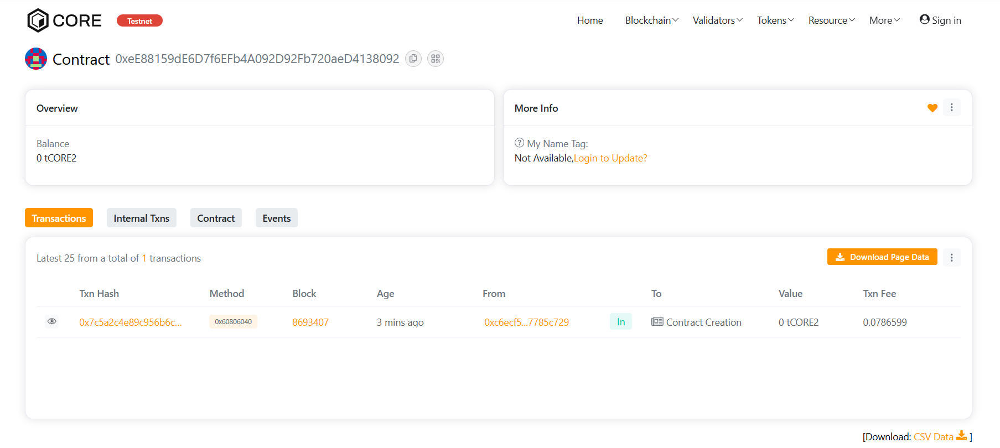

# Traffic control

## Project Description

Traffic control is a decentralized smart contract that allows secure and transparent management of traffic signals. It ensures only authorized control, supports emergency overrides, and provides signal state visibility.

## Project Vision

The goal is to digitize and decentralize urban traffic systems, ensuring safer and more efficient roads by integrating smart contracts with IoT-based sensors and emergency protocols.

## Key Features

- Control traffic signals remotely (RED, YELLOW, GREEN)
- Admin-only access to modify signals
- Emergency override to RED for safety
- View current signal state and last update timestamp

## Future Scope

- Integrate with IoT-based real-time traffic sensors
- Add role-based access for police, ambulance, and fire services
- On-chain traffic analytics and monitoring dashboard
- Mobile interface for real-time control and updates

## contract details
0xeE88159dE6D7f6EFb4A092D92Fb720aeD4138092

